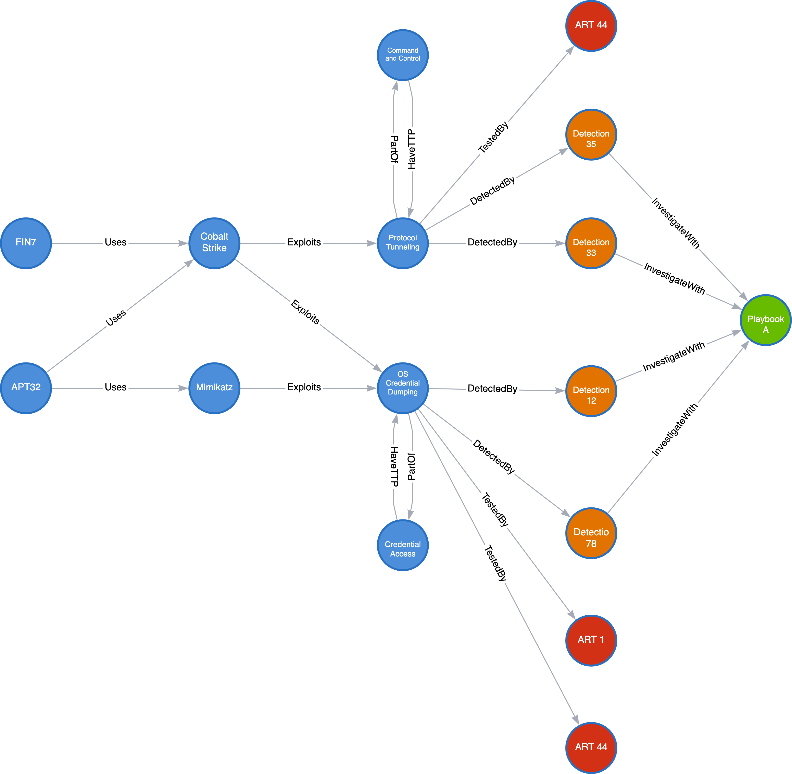
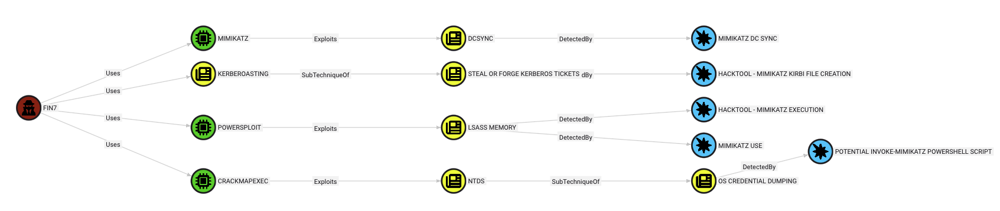
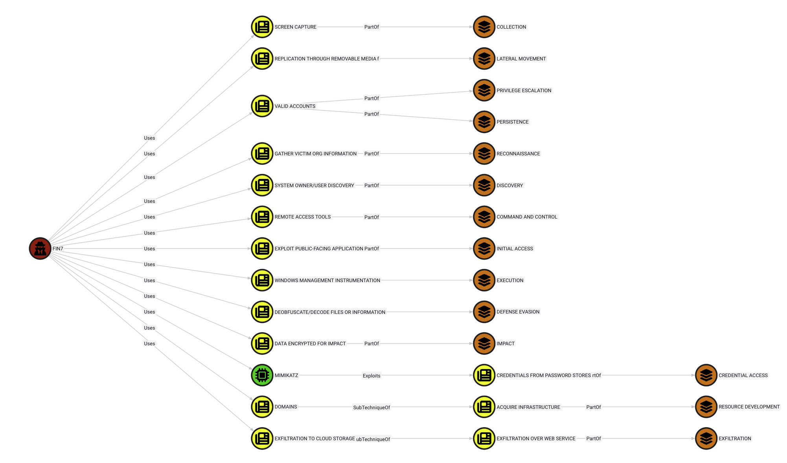
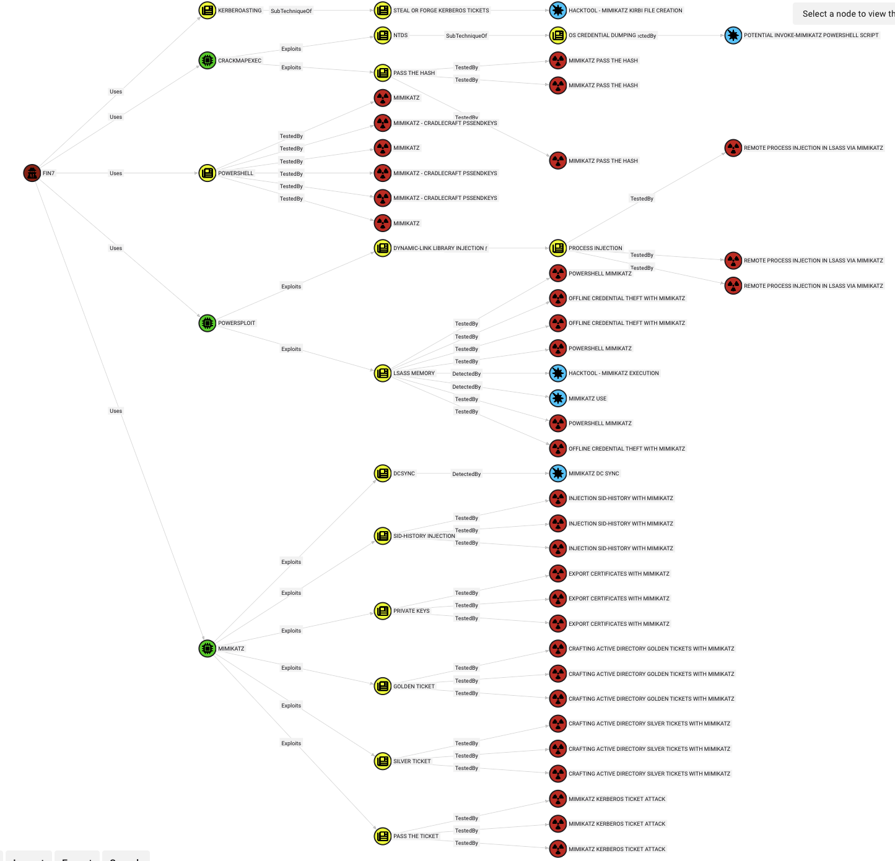
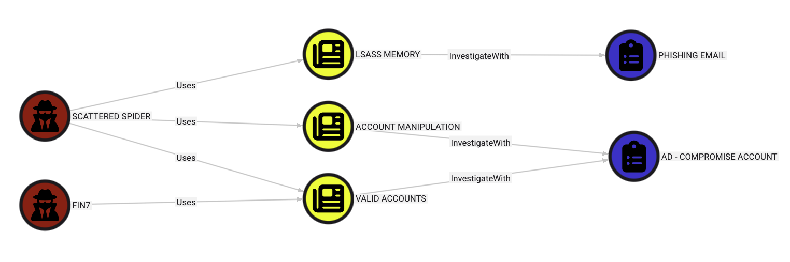

# BloodSOCer


BloodSOCer is a Python automation tool that aggregates threat intelligence data from multiple sources ([Mitre ATT&CK](https://attack.mitre.org/), [Sigma rules](https://github.com/SigmaHQ/sigma), [Atomic Red Team](https://github.com/redcanaryco/atomic-red-team)) and produces JSON files to ingest in BloodHound in OpenGraph format. BloodSOCer can also upload the files to BloodHound and set the icons for the custom objects if it has API Tokens defined in the configuration. Security analysts can then visualize the data from any angle, and a few Cypher queries are provided to help you get started. 

## Features

- **SigmaHound**: Fetch and process [Sigma](https://github.com/SigmaHQ/sigma) detection rules
- **ARTHound**: Fetch and process [Atomic Red Team](https://github.com/redcanaryco/atomic-red-team) (ART) tests
- **Define Icons**: Customize BloodHound icons for threat actors and techniques
- **Saved Queries**: Import bundled Cypher queries into BloodHound via `UL-Cyphers.py` or `--setup`
- **Batch Upload**: Upload generated JSON graphs to BloodHound with automatic ingest triggering
- **Upload Only**: If you already have the files but want to import to a new BloodHound instance or cleared the database
- **Clear Database**: Reset a BloodHound instance via API before a fresh import
- **Setup Helper**: One flag to run icon updates and saved query import together
- **CLI Interface**: Simple command-line arguments to run individual or all components

## Requirements

- Python 3.8+
- BloodHound server running (default: `http://127.0.0.1:8080`)

## Optional
- BloodHound API credentials (Token ID and Token Key)
    - If you do not supply API Keys, BloodSOCer won't be able to
        - U/L the data generated (but you can u/l it manually in the UI)
        - Create the Custom Cyphers for this project (but you can u/l them manually in the UI)
        - Set custom icons

## Installation

1. Clone the repository:
   ```bash
   git clone https://github.com/yourusername/BloodSOCer.git
   cd BloodSOCer
   ```

2. Install dependencies:
   ```bash
   pip3 install -r requirements.txt
   ```

3. Configure API credentials in `BloodSOCer.py`:
   ```python
   apikey = "your-api-key-here"
   apiid = "your-api-id-here"
   ```

## Usage

### Just YOLO it
```bash
python3 BloodSOCer.py
```

### Show help
```bash
python3 BloodSOCer.py -h
```

### Run individual hounds
```bash
python3 BloodSOCer.py --mitre, -m
python3 BloodSOCer.py --sigma, -s
python3 BloodSOCer.py --art, -r
```

### Run Define Icons
```bash
python3 BloodSOCer.py --define-icons, -di
```

### Run setup (icons + cyphers)
```bash
python3 BloodSOCer.py --setup, -st
```

### Upload files only
```bash
python3 BloodSOCer.py --upload-only, -ul
```

### Run all hounds and upload the data
```bash
python3 BloodSOCer.py --all, -a
```

### Combine multiple operations
```bash
python3 BloodSOCer.py --mitre --sigma --define-icons
```

### Delete all data in the database
```bash
python3 BloodSOCer.py --clear-db
```


**NOTE**: For `--define-icons` and `--upload-only` an API Key and API Secret **must** be defined in `BloodSOCer.py`

## Configuration

Edit `BloodSOCer.py` to customize:
- **apikey**: Your BloodHound API key
- **apiid**: Your BloodHound API ID
- **url**: BloodHound server URL (default: `http://127.0.0.1:8080`)

## File Structure

```
BloodSOCer/
├── BloodSOCer.py              # Main entry point
├── MitreHound.py              # MITRE ATT&CK data fetcher
├── ARTHound.py                # Atomic Red Team data fetcher
├── SigmaHound.py              # Sigma rules data fetcher
├── Define-Icons.py            # BloodHound icon customizer
├── UL-Cyphers.py              # Upload custom Cyphers to help query ingested data
├── Cyphers/                   # Saved queries (Cypher) JSONs
├── ressources/                # Images/diagrams (Arrows graph, logo)
├── README.md                  # This file
├── requirements.txt           # Python dependencies
└── output/                    # Generated *_graph.json files
```

## New Nodes and Edges 

### Nodes

This project adds the following node types
- TA_Group
    - Threat Actor Group
- Tactic
    - Mitre ATT&CK Tactic such as "Command and Control"
- Technique
    - Mitre ATT&CK Technique such as "OS Credential Dumping"
    - Mitre ATT&CK Sub-Technique such as "OS Credential Dumping: LSA Secrets" 
- Tool
    - Software used to perform attack such as "UACMe"
- Rule
    - Sigma Rules to detect a Technique or Sub-Technique
- ART
    - Atomic Red Team - Tests that leverage a specific Technique or Sub-Technique 
- Playbook
    - Incident Response Playbook, such as [IRP](https://gitlab.com/syntax-ir/playbooks/-/tree/main) that can be used when a Technique is successfully used by an adversary
    - **Note**: Because IRP doesn't have mapping to the Mitre ATT&CK Framework, those are not currently implemented

### Edges

This project adds the following edges/relationships
- Exploits
    - A Tool `Exploits` a (Sub-)Technique 
- Uses
    - A Threat Actor `Uses` a Tool or a (Sub-)Technique
- PartOf
    - A Technique is `PartOf` a Tactic
- SubTechniqueOf
    - A Sub-Technique is a `SubTechniqueOf` a Technique
- DetectedBy
    - A (Sub-)Technique is `DetectedBy` a Rule
- TestedBy
    - A (Sub-)Technique is `TestedBy` an ART
- InvestigateWith
    - A (Sub-)Technique is `InvestigateWith` a Playbook

### Concept Graph



To download the `json` file of this [Arrows.app](https://arrows.app/) graph click [here](./ressources/Arrows-BloodSOCer.json)

## Example Output

Detections for FIN7 using Mimikatz


Tactics used by FIN7


Detection and Test for FIN7 activity


Playbooks to investigate FIN7 & Scattered Spider activity


## Notes

- Ingestion of uploaded data may take a few minutes depending on file size and server load and ressources
- Ensure BloodHound API credentials are valid before running
- All JSON graph files must be present in the current directory before uploading
- Custom icons defined in `Define-Icons.py` will be applied to the BloodHound interface
- This tool currently do not ingest any Playbooks

## License

Apache 2.0

## Contributing

Pull requests and issues are welcome.
